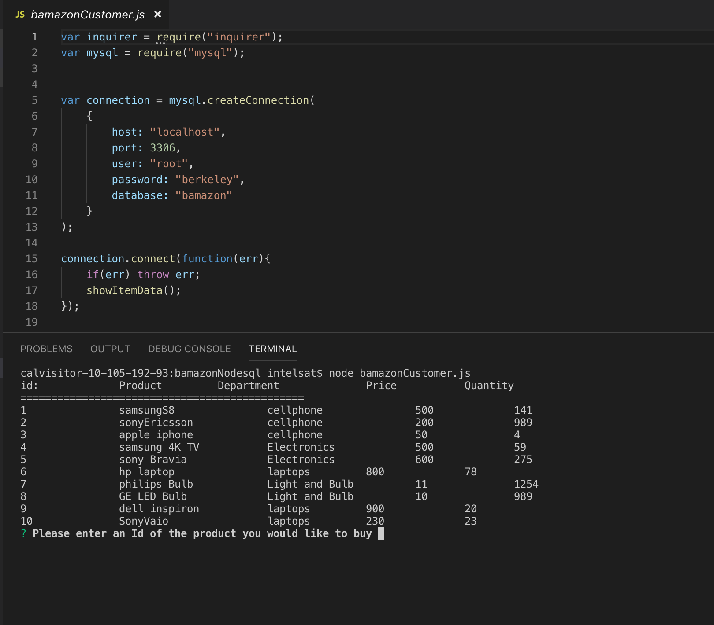
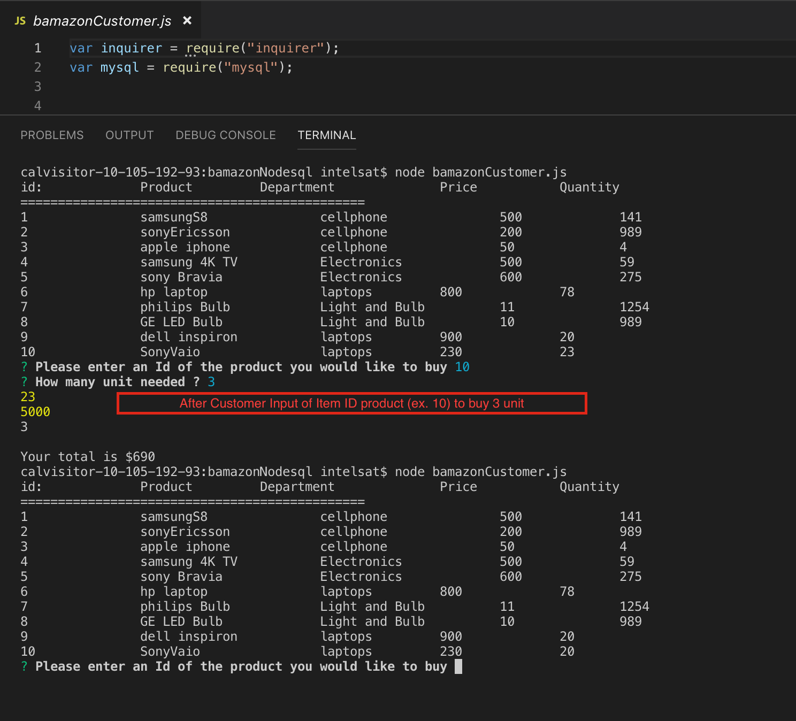

# bamazonNodeSql
Bamazon Database working with Node js  &amp; mysql for product and department tables.

# Bamazon Customer View
Bamazon Customer can see product item on sell and also can add item based on command line input which was accpeted by 
inquirer node js package. 

Inquirer prompt with asking which item_id to buy and how many unit needed, based on user input price display and customer product quantity updated in product table which resides in bamazon database.
Ex. here is Item_id 10 bought 3 in quantity so quantiy updated.

